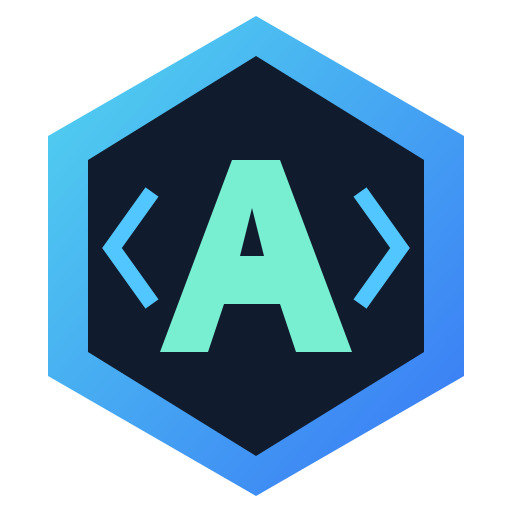
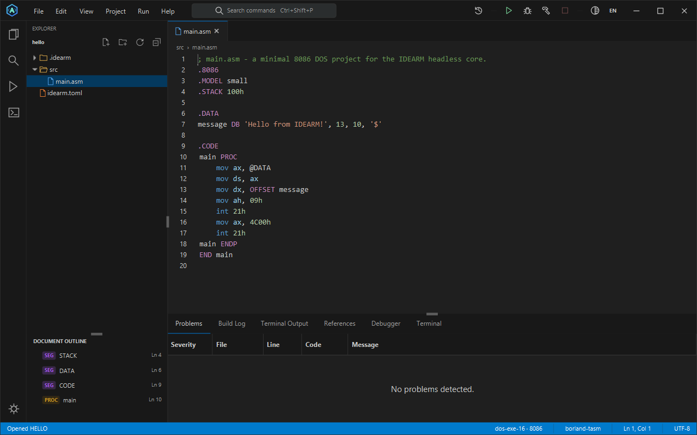
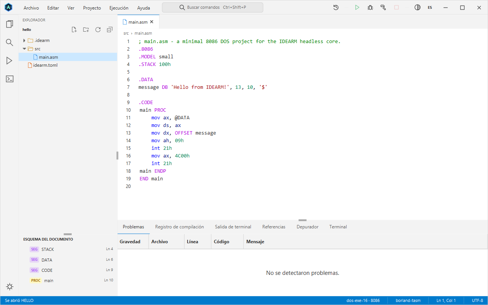

<p align="center">
  
</p>

<h1 align="center">IDEARM</h1>

<p align="center">
  <strong>Write Assembly. See how it works.</strong><br>
  A desktop IDE for learning, building and debugging x86 Assembly.
</p>

<p align="center">
  <a href="https://github.com/Dinamo541/IDEARM/actions/workflows/ci.yml"></a>
  
  
  
  <a href="LICENSE"></a>
</p>

<p align="center">
  <a href="#installation">Install</a> ·
  <a href="#first-project">First project</a> ·
  <a href="#inside-the-workbench">Screenshots</a> ·
  <a href="#documentation">Documentation</a> ·
  <a href="#contributing-and-support">Contribute</a>
</p>

IDEARM brings your editor, assembler, linker and debugger into one workspace. Create a project, write your
program, then build, run or debug it with a keyboard shortcut. Every tool command remains visible in the
**Build Log**, so you can learn what happens between source code and a running program.

## Installation

### 1. Get the app

Download the file for your system from the
[latest release](https://github.com/Dinamo541/IDEARM/releases/latest). Every package carries its own Java
runtime, so there is nothing else to install first.

| Platform | Download | How to install |
| --- | --- | --- |
| Windows 10 / 11, x64 | `IDEARM-<version>-windows-x64.msi` | Double-click it. It installs for your user only, so it asks for no administrator rights, and adds IDEARM to the Start menu and the desktop. |
| Windows, without installing | `IDEARM-<version>-windows-x64-portable.zip` | Unzip it anywhere and run `IDEARM\IDEARM.exe`. |
| Ubuntu / Debian, x64 | `IDEARM-<version>-linux-x64.deb` | `sudo apt install ./IDEARM-<version>-linux-x64.deb`, which also installs DOSBox, NASM, binutils and GDB. |
| Other Linux, x64 | `IDEARM-<version>-linux-x64.tar.gz` | Extract it and run `IDEARM/bin/IDEARM`. Needs GTK 3 (`libgtk-3-0`), which every desktop has. |
| macOS | — | Untested; build from source. |

The installer is not signed, so Windows shows "Windows protected your PC": choose **More info → Run anyway**.
The release page also has `SHA256SUMS.txt` if you want to check the download. Each package includes
`idearm-cli`, the command line, next to the application.

<details>
<summary><strong>Or build and run it from source</strong></summary>

Install [Git](https://git-scm.com/downloads), [JDK 25](https://adoptium.net/temurin/releases/?version=25) and
[Maven 3.9+](https://maven.apache.org/download.cgi), then run these commands in PowerShell or a Linux terminal:

```sh
git clone https://github.com/Dinamo541/IDEARM.git
cd IDEARM
mvn install -DskipTests
mvn -f idearm-app/pom.xml javafx:run
```

The first build needs an internet connection to download Maven dependencies. Check `java -version` and
`mvn -version` if the build fails: Maven must use JDK 25 or newer. Linux needs a graphical desktop session.

`pwsh scripts/package-native.ps1` builds the packages above for the system you run it on (the Windows installer
needs the WiX Toolset; the Linux package needs `fakeroot`).

</details>

### 2. Install your Assembly tools

Choose the row that matches the programs you want to write. These tools are separate from the IDE itself.

| Your target | Required tools | Debugger |
| --- | --- | --- |
| 16-bit DOS with TASM | Your own TASM + TLINK, and DOSBox | Built-in 8086 emulator; optional Turbo Debugger |
| 16-bit DOS with MASM | Your own MASM 6.11 + 16-bit LINK, and DOSBox; `DOSXNT.EXE` on Linux | Built-in 8086 emulator; optional CodeView |
| 32-bit / 64-bit Windows | NASM + GNU ld | GDB |
| 64-bit Linux | NASM + GNU ld (binutils) | GDB |

**Windows — native Assembly tools:** install [MSYS2](https://www.msys2.org/), open its **UCRT64** terminal,
and run:

```sh
pacman -S --needed mingw-w64-ucrt-x86_64-nasm mingw-w64-ucrt-x86_64-binutils mingw-w64-ucrt-x86_64-gdb
```

IDEARM detects the default `C:\msys64\ucrt64\bin` location automatically. For DOS projects, install
[DOSBox](https://www.dosbox.com/), [DOSBox-X](https://dosbox-x.com/) or
[DOSBox Staging](https://www.dosbox-staging.org/), and register your TASM or MASM folder in the next step.

**Debian / Ubuntu — DOSBox and native Assembly tools:**

```sh
sudo apt update
sudo apt install dosbox nasm binutils gdb
```

TASM, TLINK, Turbo Debugger, MASM, LINK and CodeView are proprietary and are **never bundled or downloaded by
IDEARM**. You supply your own copies. The default DOSBox selection prefers 0.74-3, then DOSBox-X, then Staging.

### 3. Check your setup

Open **Help → Tool Doctor...** to see detected tools, versions and paths. If a tool is missing, choose
**Add Tools Folder...** and select its installation folder. IDEARM remembers it for future sessions.

You can switch the interface to Spanish with the **EN/ES** control in the top-right corner. Menu names in
this README use the default English interface.

## First project

1. Choose **File → New Project...** (`Ctrl+Shift+N`), select a target profile and toolchain, and create a project.
2. Open `src/main.asm` and edit the generated starter program.
3. Press **F7** to build, then **Ctrl+F5** to run. Use **Run → Run (Pause on Exit)** to keep the output visible.
4. Set a breakpoint with **F9** and press **F5** to debug. Inspect registers, flags, watches and memory as you step.

You can also open an existing example folder with **File → Open Project...**:

| Example | What you learn | Target / tools |
| --- | --- | --- |
| [`hello`](examples/hello) | Print a greeting and return to DOS | 16-bit DOS · TASM + TLINK + DOSBox |
| [`hello-input`](examples/hello-input) | Read keyboard input and inspect execution in the built-in debugger | 16-bit DOS · TASM + TLINK + DOSBox |
| [`hello64-nasm`](examples/hello64-nasm) | Write a native Windows console program | 64-bit Windows · NASM + GNU ld; GDB for debugging |

On Linux, create a project with the `linux-elf64` profile for a native starter program. The `hello64-nasm`
example uses the Windows API and is intended for Windows.

## Inside the workbench



<p align="center"><em>The IDEARM workbench in English, with the dark theme and the hello project open.</em></p>

<details>
<summary><strong>See the light theme and Spanish interface</strong></summary>



Both the theme and interface language can be changed from the workbench.

</details>

| Capability | What you can do |
| --- | --- |
| **Assembly-aware editing** | Syntax highlighting, completion, instruction and number hover help, definitions, references and educational warnings. |
| **Build, run and package** | Let IDEARM coordinate assemblers, linkers and execution environments; inspect every command in the Build Log. |
| **Visual debugging** | Use breakpoints, stepping, registers, flags, watches and memory; GDB adds a native call stack. |
| **Built-in 8086 emulator** | Debug DOS programs in the IDE, type into their console and inspect runtime faults at the failing instruction. |
| **Familiar workspace** | Project explorer, document outline, tabs, integrated terminal, command palette and recent items. |
| **English and Spanish** | Switch languages at runtime, including messages already on screen; choose a light or dark theme. |
| **Source encoding preservation** | Open UTF-8 and Windows-1252 files while preserving their encoding and line endings when possible. |
| **Command-line workflow** | Build, run, package and diagnose projects from scripts, with JSON output for supported commands. |

### Execution and compatibility

Programs run from a staging copy of the project. DOSBox sessions enter secure mode after IDEARM mounts the
working folders, preventing the DOS program from mounting other host folders. **Native Windows and Linux
programs run with your operating-system permissions; staging is not an OS sandbox.**

- Native programs run and debug on their matching operating system. The Windows linker integration currently
  supports `kernel32`; other Windows libraries are not linked by the IDE yet.
- The built-in debugger focuses on the 8086 and selected DOS/BIOS services. For programs needing unsupported
  instructions, DOS file services or graphics, use Turbo Debugger or CodeView through DOSBox.
- Linux program input is available during normal execution; interactive input under GDB is currently limited.
- Linux window controls still need verification on a real desktop; macOS remains untested.

See the [user guide](docs/user-guide.md) for target configuration and the
[troubleshooting guide](docs/troubleshooting.md) for tool-specific limitations.

## Essential shortcuts

| Shortcut | Action |
| --- | --- |
| `Ctrl+Shift+N` | Create a project |
| `F7` / `Ctrl+Shift+B` | Build |
| `Ctrl+F5` | Run |
| `F5` / `Shift+F5` | Start or continue debugging / stop |
| `F9` | Toggle a breakpoint |
| `F10` / `F11` / `Shift+F11` | Step over / into / out during debugging |
| `Ctrl+Space` | Code completion |
| `F12` / `Shift+F12` | Go to definition / find references |
| `Ctrl+Shift+P` | Open the command palette |

See [all editor and workbench shortcuts](docs/workbench-shortcuts.md).

## Command line

After building from source, run the launcher from the repository root.

**Windows / PowerShell:**

```powershell
.\scripts\idearm.ps1 doctor
.\scripts\idearm.ps1 build examples/hello64-nasm --config debug
.\scripts\idearm.ps1 run examples/hello64-nasm
.\scripts\idearm.ps1 dist examples/hello64-nasm
```

**Linux / shell:**

```sh
sh scripts/idearm.sh doctor
sh scripts/idearm.sh build /path/to/your/linux-project --config debug
sh scripts/idearm.sh run /path/to/your/linux-project
```

Replace `/path/to/your/linux-project` with a project created using the `linux-elf64` profile. DOS projects
work through the same launchers when their required tools are installed. See the
[CLI reference](docs/user-guide.md#8-the-command-line) for `clean`, `import`, `tools add` and `--json` options.

## Documentation

| Resource | Contents |
| --- | --- |
| [User guide](docs/user-guide.md) | Tool setup, project configuration, DOS and native workflows, debugger and CLI. |
| [Troubleshooting](docs/troubleshooting.md) | Build, link, run, debug and packaging problems with causes and fixes. |
| [Keyboard shortcuts](docs/workbench-shortcuts.md) | Editing commands, navigation and workbench controls. |
| [Contributing](CONTRIBUTING.md) | Development setup, checks and pull request guidance. |
| [Project brief and status](PLAN.md) | Architecture, verified facts, current status and next steps. |
| [Technical plan](docs/technical-plan.md) | Requirements, design, domain model and toolchain strategy. |
| [Architecture decisions](docs/adr/) | Recorded decisions and their rationale. |
| [Action plan](docs/action-plan.md) | Prioritized work and completion criteria. |
| [Visual identity](docs/branding.md) | Logo assets, colors and regeneration instructions. |

## Development

IDEARM uses **Java 25**, **JavaFX 25**, **RichTextFX**, **AtlantaFX**, **Maven** and **JPMS**. Its modules follow
the dependency direction `Presentation → Application → Domain ← Infrastructure`.

| Layer | Modules |
| --- | --- |
| Presentation | `idearm-app` — JavaFX desktop UI; `idearm-cli` — command-line interface |
| Application | `idearm-application` — project, build, run, debug and packaging use cases |
| Domain | `idearm-domain` — models, rules and ports; `idearm-language` — Assembly language services |
| Infrastructure | `idearm-infrastructure`, `idearm-toolchain-dos`, `idearm-toolchain-nasm`, `idearm-emu8086` |

### Build and test

```sh
mvn verify
```

For tests only, use `mvn test`. Tests tagged `requires-tasm`, `requires-masm`, `requires-nasm` or
`requires-dosbox` are excluded by default. With TASM, DOSBox, NASM, GNU ld and GDB registered locally:

```sh
mvn test -Plocal-tools
```

The `local-tools` profile keeps `requires-masm` tests excluded. See
[contributing](CONTRIBUTING.md#validation) for selecting tool-dependent tests explicitly.
[CI](https://github.com/Dinamo541/IDEARM/actions/workflows/ci.yml) runs the default suite on Windows and also
tests against real NASM, GNU ld, GDB and DOSBox on Ubuntu. Proprietary tools are excluded from CI.

### Create a portable build

From the repository root, with **PowerShell 7+** and the source-build prerequisites installed:

```powershell
.\scripts\package-native.ps1 -Type app-image
```

On Windows this creates `dist/release/IDEARM-<version>-windows-x64-portable.zip` and its SHA-256 file.
Extract the ZIP and start `IDEARM/IDEARM.exe`. On Linux, run
`pwsh -File scripts/package-native.ps1 -Type app-image` to create a `.tar.gz` archive instead.

The [packaging script](scripts/package-native.ps1) also supports `-Type installer` for Windows MSI or Linux
DEB packages. Installer builds need WiX on Windows, or `dpkg-deb` and `fakeroot` on Linux. See the
[release workflow](.github/workflows/release.yml) for automated release builds.

## Contributing and support

Bug reports, documentation improvements, reproducible examples and code contributions are welcome. Read
[CONTRIBUTING.md](CONTRIBUTING.md) before opening a pull request.

- **Need help?** Start with [troubleshooting](docs/troubleshooting.md).
- **Found a bug?** [Open a bug report](https://github.com/Dinamo541/IDEARM/issues/new?template=bug_report.yml)
  with steps to reproduce, your target profile, Tool Doctor results and the relevant Build Log.
- **Have an idea?** [Suggest an improvement](https://github.com/Dinamo541/IDEARM/issues/new?template=feature_request.yml)
  and explain the learning or development workflow it would improve.

## License and credits

Created by **Dominique Mariano Castro**. IDEARM is available under the [MIT License](LICENSE).

Built with JavaFX, RichTextFX and AtlantaFX, and designed to work with DOSBox, NASM, GNU binutils and GDB.
Third-party software retains its own licenses. TASM, TLINK, Turbo Debugger, MASM, LINK and CodeView belong to
their respective owners and are not included in this repository or its packages.

<p align="center"><a href="#idearm">Back to top ↑</a></p>
